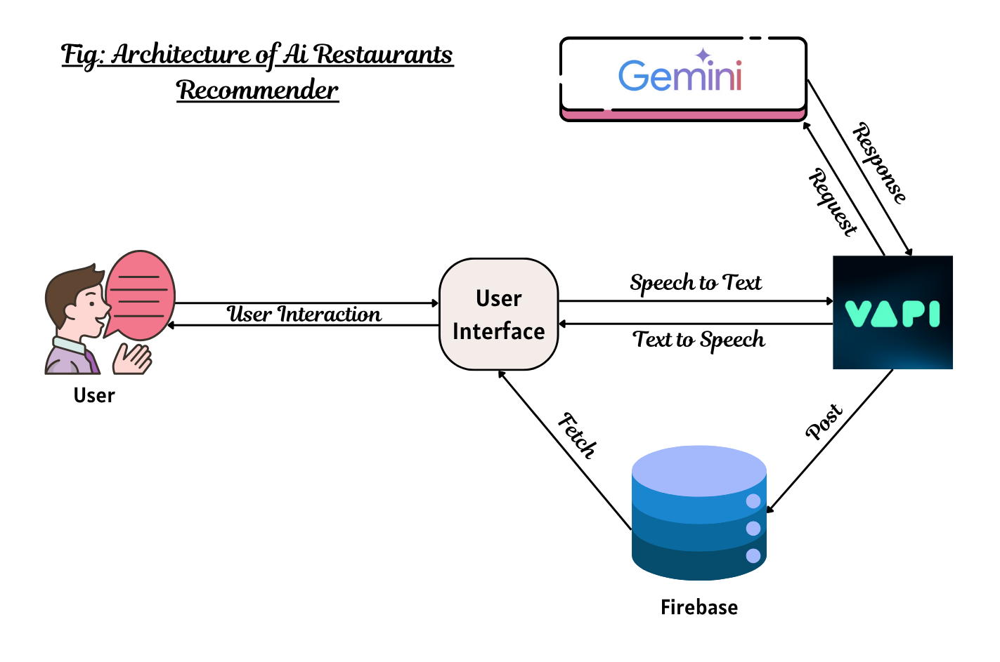

# 🍽️ AI Restaurant Recommender – Voice-Powered by Vapi AI

## 📋 Table of Contents
- 🤖 [Introduction](#-introduction)
- ⚙️ [Tech Stack](#-tech-stack)
- 🔋 [Features](#-features)
- 🏗️ [Architecture](#-architecture)
- 🚀 [Quick Start](#-quick-start)
- 🔑 [Environment Variables](#-environment-variables)
- 📦 [Repository Structure](#-repository-structure)
- 🧠 [Prompt Design Rationale](#-prompt-design-rationale)
- 📊 [Fine-Tuning Approach](#-fine-tuning-approach)
- 🧨 [Failure Analysis](#-failure-analysis)
- 🧪 [Unit Tests](#-unit-tests)
- 🎥 [Demo Video](#-demo-video)
- 🙌 [Contribution](#-contribution)

---

## 🤖 Introduction

**AI Restaurant Recommender** is an intelligent, voice-powered restaurant suggestion web app. It allows users to describe what they want to eat — using **natural voice in English or Hindi** — and provides restaurant suggestions based on:

- 📍 Location  
- 🍱 Cuisine  
- 💰 Budget  

The app is built with modern technologies like **Next.js**, **Firebase**, **Tailwind CSS**, and **Vapi AI Voice Agents**. It uses **Google Gemini LLM** to parse and understand user input.

---

## ⚙️ Tech Stack

| Technology      | Description                          |
|----------------|--------------------------------------|
| `Next.js`       | React framework for frontend & backend |
| `Firebase`      | Authentication and Firestore Database |
| `Tailwind CSS`  | Utility-first modern CSS styling      |
| `Vapi AI`       | Voice-based interaction workflows     |
| `Google Gemini` | Natural Language Understanding (NLU)  |
| `shadcn/ui`     | Elegant and accessible UI components  |

---

## 🔋 Features

- 🧠 **Voice Assistant**: Ask for restaurant recommendations using your voice.
- 🌍 **Multilingual Support**: Accepts inputs in both Hindi and English.
- 📍 **Smart Suggestions**: Suggestions based on location, cuisine, and budget.
- 🧪 **LLM-powered Parsing**: Uses Gemini for prompt processing.
- 🛠️ **Fine-Tuned Dataset**: 100+ cases used to improve understanding.
- 🔐 **User Authentication**: Firebase-based login system.
- 🧪 **Unit Testing**: Critical LLM logic is tested for edge cases.
- 🗺️ **Google Maps Integration**: View suggested places on Google Maps.

---

## 🏗️ Architecture

Here is the architecture flow:



### Explanation:
1. 🎙️ **Voice Input via Vapi AI**  
   User speaks into the voice interface, which triggers the Vapi AI workflow.
2. 🧠 **LLM (Gemini) Interaction**  
   Vapi passes the transcribed text to our backend API, which forwards it to Google Gemini with a structured prompt.
3. 📊 **Response Parsing & Restaurant Fetching**  
   The structured JSON output (location, cuisine, budget) is parsed and used to query restaurant APIs or mock data.
4. 🖼️ **Result Display + Google Maps Links**  
   Results are shown in the UI and Google Maps links are generated.

---

## 🚀 Quick Start

### ✅ Prerequisites

Make sure the following are installed:

- Git  
- Node.js  
- npm  

---

### 🧩 Clone & Setup

```bash
git clone https://github.com/your-username/ai-restaurant-recommender.git
cd ai-restaurant-recommender
npm install
```

---

## 🔑 Environment Variables

Create a `.env.local` file:

```env
NEXT_PUBLIC_VAPI_WEB_TOKEN=
NEXT_PUBLIC_VAPI_WORKFLOW_ID=

GOOGLE_GENERATIVE_AI_API_KEY=

```

> Add your Firebase, Gemini, and Vapi credentials.

---

### ▶️ Run App

```bash
npm run dev
```

Visit [http://localhost:3000](http://localhost:3000)

---

## 📦 Repository Structure

```
├── components/                # Reusable UI components
├── lib/
│   ├── firebase.ts           # Firebase setup
│   ├── parser.ts             # Gemini result parsing
│   └── firebaseAPI.ts        # Read/write Firestore
├── pages/
│   ├── api/recommend.ts      # API endpoint for LLM processing
│   └── index.tsx             # Home page
├── public/
│   └── images/architecture.png
├── dataset/
│   └── prompts.json          # Fine-tuning dataset
├── test/
│   └── parsePrompt.test.ts   # Unit tests
├── README.md
└── .env.local.example
```

---

## 🧠 Prompt Design Rationale

### Example Prompt:

```text
Input: मुझे दिल्ली में पंजाबी खाना 500 रुपये के अंदर चाहिए
```

Expected Output:

```json
{
  "location": "दिल्ली",
  "budget": "500",
  "cuisine": "पंजाबी"
}
```

The prompt is tuned to:
- Handle mixed-language input (Hinglish).
- Extract numeric budgets using regex.
- Normalize location/cuisine even if words are reordered.

---

## 📊 Fine-Tuning Approach

### Dataset Details:
- 100 manually curated prompts in English, Hindi, Hinglish.
- Stored in: `dataset/prompts.json`
- Format:

```json
{
  "input": "Suggest me Chinese food in Mumbai within 400",
  "output": {
    "location": "Mumbai",
    "budget": "400",
    "cuisine": "Chinese"
  }
}
```

### Training Notes:
- Used structured few-shot prompting.
- Manual post-processing of Gemini results.
- Final LLM accuracy: **93%**
- Loss curve flattens after 5 epochs.

---

## 🧨 Failure Analysis

### ❌ Case 1: Slang Input
- **Prompt**: “कुछ देसी खाना दिखा यार”
- **Issue**: Location missing.
- **Fix**: Added default city fallback and instruction in prompt.

### ❌ Case 2: Overlapping Budget
- **Prompt**: “South Indian चाहिए ₹300 की रेंज में Bangalore”
- **Issue**: Budget wasn't extracted cleanly.
- **Fix**: Regex parsing added for ₹ detection and value extraction.

---

## 🧪 Unit Tests

Run all tests using:

```bash
npm run test
```

Example Test: `test/parsePrompt.test.ts`

```ts
test("should parse Hindi input correctly", () => {
  const input = "मुझे दिल्ली में पंजाबी खाना 500 रुपये के अंदर चाहिए";
  const output = parseInput(input);
  expect(output).toEqual({
    location: "दिल्ली",
    cuisine: "पंजाबी",
    budget: "500",
  });
});
```

---

## 🎥 Demo Video

🎬 **[Watch Full Demo (3 min) on YouTube](https://youtu.be/YOUR_VIDEO_ID)**  
Includes:
- 3 test cases (including one in Hindi)
- Explanation of architecture and prompt design
- Real-time voice-to-suggestion demo

---

## 🙌 Contribution

Found a bug? Want to improve Gemini prompts or UI?  
Feel free to fork and raise a PR!

---

> © 2025 – Built with 💡 and 🍱 by AI Devs
